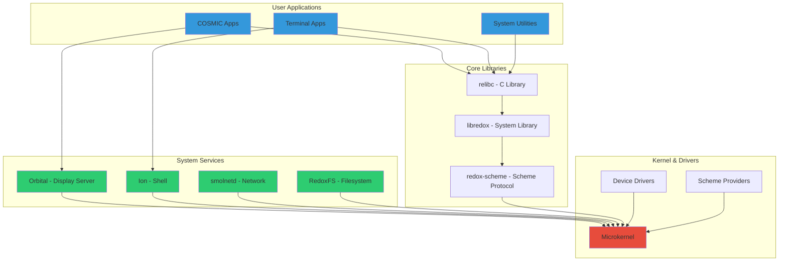
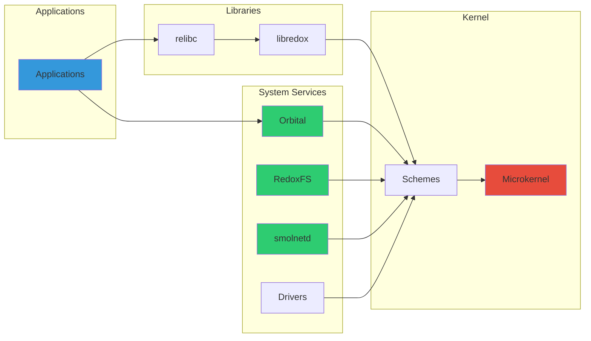

## System Architecture

Redox OS consists of multiple layers and components working together:



## Core Components

### Kernel

The Redox microkernel is the heart of the system:

<CardGroup cols={2}>
  <Card title="Size" icon="cube">
    ~20,000 lines of Rust code
  </Card>
  <Card title="Role" icon="gears">
    Process management, memory, IPC, core schemes
  </Card>
  <Card title="Repository" icon="code-branch">
    [redox-os/kernel](https://gitlab.redox-os.org/redox-os/kernel)
  </Card>
  <Card title="Maintainer" icon="user">
    @jackpot51
  </Card>
</CardGroup>

**Key Responsibilities:**

- Process and thread scheduling
- Virtual memory management
- System call handling
- Basic scheme providers (memory, pipe, irq, time)

```rust
// Kernel provides core schemes
const KERNEL_SCHEMES: &[&str] = &[
    "debug",   // Debug output
    "event",   // Event notification
    "memory",  // Physical memory access
    "pipe",    // Pipe IPC
    "serio",   // Serial I/O
    "irq",     // Interrupt handling
    "time",    // System time
    "sys",     // System information
];
```

### Base System Components

The `base` repository contains essential system components and drivers:

<Tabs>
  <Tab title="Scheme Providers">
    ```bash
    # Essential scheme daemons
    randd        # Random number generator (rand:)
    nulld        # Null device (null:)
    zerod        # Zero device (zero:)
    ptyd         # Pseudo-terminal (pty:)
    ```
  </Tab>
  <Tab title="Device Drivers">
    ```bash
    # Hardware drivers
    ps2d         # PS/2 keyboard/mouse
    e1000d       # Intel E1000 network card
    rtl8168d     # Realtek network card
    nvmed        # NVMe storage
    ahcid        # SATA/AHCI storage
    xhcid        # USB 3.0
    ```
  </Tab>
  <Tab title="Services">
    ```bash
    # System services
    ipcd         # IPC coordinator
    pcid         # PCI device manager
    vesad        # VESA graphics
    ac97d        # Audio driver
    ```
  </Tab>
</Tabs>

### File Systems

#### RedoxFS

The default file system for Redox OS:

<Info>
RedoxFS is a Copy-on-Write (CoW) file system inspired by ZFS and BTRFS, designed specifically for Redox.
</Info>

**Features:**

- Copy-on-Write semantics
- Built-in compression
- Checksumming for data integrity
- Snapshots
- Written entirely in Rust

```rust
// RedoxFS structure (simplified)
pub struct RedoxFS {
    disk: Disk,
    header: Header,
    nodes: BTreeMap<u64, Node>,
    // CoW allocation
}

impl Scheme for RedoxFS {
    fn open(&mut self, path: &str, flags: OpenFlags) -> Result<usize>;
    fn read(&mut self, id: usize, buf: &mut [u8]) -> Result<usize>;
    fn write(&mut self, id: usize, buf: &[u8]) -> Result<usize>;
    // ...
}
```

#### Other File Systems

<CardGroup cols={2}>
  <Card title="ext4" icon="hard-drive">
    Linux ext4 support for compatibility
  </Card>
  <Card title="FAT32" icon="usb">
    FAT32 for USB drives and boot partitions
  </Card>
  <Card title="ISO 9660" icon="compact-disc">
    CD/DVD file system support
  </Card>
  <Card title="tmpfs" icon="memory">
    RAM-based temporary file system
  </Card>
</CardGroup>

### Network Stack

#### smolnetd

Redox's network service based on the smoltcp library:

```toml
# Network initialization from base.toml
[files]
path = "/usr/lib/init.d/10_net"
data = """
requires_weak 00_drivers
notify smolnetd
nowait dhcpd
"""
```

**Supported Protocols:**

<Tabs>
  <Tab title="Network Layer">
    - IPv4 (full support)
    - IPv6 (planned)
    - ICMP (ping, traceroute)
    - ARP (address resolution)
  </Tab>
  <Tab title="Transport Layer">
    - TCP (reliable streams)
    - UDP (datagrams)
    - Raw sockets
  </Tab>
  <Tab title="Application Layer">
    - DNS resolution
    - DHCP client
    - HTTP (via libraries)
  </Tab>
</Tabs>

**Network Scheme Example:**

```rust
use std::net::TcpStream;
use std::io::{Read, Write};

fn main() -> std::io::Result<()> {
    // Opens tcp: scheme via smolnetd
    let mut stream = TcpStream::connect("example.com:80")?;
    
    stream.write_all(b"GET / HTTP/1.0\r\n\r\n")?;
    
    let mut response = String::new();
    stream.read_to_string(&mut response)?;
    
    println!("Response: {}", response);
    Ok(())
}
```

### Display Server - Orbital

Orbital is Redox's display server and window manager:

<CardGroup cols={2}>
  <Card title="Architecture" icon="window">
    Compositing window manager with GPU acceleration
  </Card>
  <Card title="Features" icon="palette">
    Window management, event handling, 2D graphics
  </Card>
  <Card title="Scheme" icon="link">
    Provides `orbital:` and `display:` schemes
  </Card>
  <Card title="Desktop" icon="desktop">
    Integrates with COSMIC desktop apps
  </Card>
</CardGroup>

**Orbital Operations:**

```rust
// Creating a window via orbital: scheme
use orbclient::{Color, Renderer, Window};

fn main() {
    let mut window = Window::new(
        100, 100, 800, 600,
        "My Application"
    ).unwrap();
    
    window.set(Color::rgb(255, 255, 255));
    window.sync();
    
    // Event loop
    'events: loop {
        for event in window.events() {
            // Handle keyboard, mouse, etc.
        }
    }
}
```

### Shell - Ion

Ion is the default shell for Redox:

```bash
# Ion shell configuration
[users.root]
shell = "/usr/bin/ion"

[users.user]
shell = "/usr/bin/ion"
```

**Ion Features:**

<AccordionGroup>
  <Accordion title="Modern Syntax">
    ```bash
    # Variables with types
    let name = "Redox"
    let count: int = 42
    
    # Array operations
    let files = [file1.txt file2.txt file3.txt]
    echo @files
    ```
  </Accordion>
  
  <Accordion title="Functions">
    ```bash
    fn greet name
        echo "Hello, $name!"
    end
    
    greet "World"
    ```
  </Accordion>
  
  <Accordion title="Error Handling">
    ```bash
    # Try-catch style error handling
    if test -f file.txt
        cat file.txt
    else
        echo "File not found"
    end
    ```
  </Accordion>
</AccordionGroup>

### C Library - relibc

Relibc is Redox's C standard library, written in Rust:

<Info>
Relibc provides POSIX compatibility, enabling many Linux and BSD programs to run on Redox with minimal or no modifications.
</Info>

**Key Features:**

- POSIX function implementations
- Thread support (pthreads)
- Dynamic linking
- C++ standard library support (via libstdc++)
- Rust implementation for memory safety

```c
// Standard C programs work on Redox
#include <stdio.h>
#include <stdlib.h>
#include <unistd.h>

int main() {
    // These POSIX functions are provided by relibc
    char cwd[PATH_MAX];
    getcwd(cwd, sizeof(cwd));
    printf("Current directory: %s\n", cwd);
    
    FILE* f = fopen("/file/data.txt", "r");
    if (f) {
        // File I/O works through Redox schemes
        char buf[256];
        fgets(buf, sizeof(buf), f);
        printf("Content: %s", buf);
        fclose(f);
    }
    
    return 0;
}
```

### System Library - libredox

Libredox provides Rust access to Redox-specific functionality:

```rust
use redox_scheme::Scheme;
use libredox::flag::*;

// Open a scheme URL
let fd = libredox::call::open(
    "tcp:example.com:80",
    O_RDWR | O_CLOEXEC
)?;

// Write data
libredox::call::write(fd, b"GET / HTTP/1.0\r\n\r\n")?;

// Read response
let mut buffer = [0u8; 4096];
let bytes_read = libredox::call::read(fd, &mut buffer)?;

// Close
libredox::call::close(fd)?;
```

### Package Manager - pkgutils

Redox's package manager for installing and managing software:

<Tabs>
  <Tab title="Installation">
    ```bash
    # Install a package
    pkg install rust
    
    # Install from specific repository
    pkg install --repo=https://static.redox-os.org/pkg rust
    ```
  </Tab>
  <Tab title="Updates">
    ```bash
    # Update package database
    pkg update
    
    # Upgrade all packages
    pkg upgrade
    
    # Upgrade specific package
    pkg upgrade rust
    ```
  </Tab>
  <Tab title="Management">
    ```bash
    # List installed packages
    pkg list
    
    # Search for packages
    pkg search compiler
    
    # Remove package
    pkg remove rust
    ```
  </Tab>
</Tabs>

**Package Configuration:**

```toml
# Package repository configuration from base.toml
[[files]]
path = "/etc/pkg.d/50_redox"
data = "https://static.redox-os.org/pkg"
```

## System Initialization

Redox uses init scripts for system startup:

### Base Initialization

```bash
# From base.toml: /usr/lib/init.d/00_base
# Clear and recreate tmpdir with 0o1777 permission
rm -rf /tmp
mkdir -m a=rwxt /tmp

notify ipcd   # Start IPC coordinator
notify ptyd   # Start pseudo-terminal daemon
nowait sudo --daemon  # Start privilege daemon
```

### Driver Initialization

```bash
# From base.toml: /usr/lib/init.d/00_drivers
requires_weak 00_base
pcid-spawner  # PCI device manager spawns drivers
```

### Network Initialization

```bash
# From base.toml: /usr/lib/init.d/10_net
requires_weak 00_drivers
notify smolnetd  # Start network stack
nowait dhcpd     # Start DHCP client
```

<Note>
Init scripts use `notify` for services that should complete startup before continuing, and `nowait` for background services.
</Note>

## System Utilities

Redox includes essential Unix-like utilities:

<CardGroup cols={2}>
  <Card title="uutils" icon="tools">
    Rust implementation of core Unix utilities (ls, cp, mv, etc.)
  </Card>
  <Card title="userutils" icon="users">
    User management tools (login, sudo, passwd)
  </Card>
  <Card title="netutils" icon="network-wired">
    Network utilities (ping, wget, nc)
  </Card>
  <Card title="coreutils" icon="terminal">
    Additional system utilities
  </Card>
</CardGroup>

```bash
# Standard Unix commands work as expected
ls -la /
ps aux
netstat -an
top
free -h
df -h
```

## Device Management

Devices in Redox are accessed through schemes:

```bash
# Device file symlinks from base.toml
/dev/null    -> /scheme/null
/dev/random  -> /scheme/rand
/dev/urandom -> /scheme/rand
/dev/zero    -> /scheme/zero
/dev/tty     -> libc:tty
/dev/stdin   -> libc:stdin
/dev/stdout  -> libc:stdout
/dev/stderr  -> libc:stderr
```

<Tip>
Unlike Linux's `/dev` which contains thousands of device nodes, Redox uses lightweight symlinks to scheme URLs.
</Tip>

## Component Diagram

Complete system overview:



## Key Repositories

<CardGroup cols={2}>
  <Card title="Kernel" icon="code-branch" href="https://gitlab.redox-os.org/redox-os/kernel">
    Core microkernel implementation
  </Card>
  <Card title="Base" icon="code-branch" href="https://gitlab.redox-os.org/redox-os/base">
    Essential system components and drivers
  </Card>
  <Card title="RedoxFS" icon="code-branch" href="https://gitlab.redox-os.org/redox-os/redoxfs">
    Default file system
  </Card>
  <Card title="relibc" icon="code-branch" href="https://gitlab.redox-os.org/redox-os/relibc">
    C standard library
  </Card>
  <Card title="Ion" icon="code-branch" href="https://gitlab.redox-os.org/redox-os/ion">
    Default shell
  </Card>
  <Card title="Orbital" icon="code-branch" href="https://gitlab.redox-os.org/redox-os/orbital">
    Display server
  </Card>
  <Card title="pkgutils" icon="code-branch" href="https://gitlab.redox-os.org/redox-os/pkgutils">
    Package manager
  </Card>
  <Card title="libredox" icon="code-branch" href="https://gitlab.redox-os.org/redox-os/libredox">
    System library
  </Card>
</CardGroup>

## Next Steps

<CardGroup cols={2}>
  <Card title="Scheme System" icon="link" href="/architecture/schemes">
    Learn about the scheme system in detail
  </Card>
  <Card title="Contributing" icon="code" href="/contributing">
    Start contributing to Redox components
  </Card>
</CardGroup>
