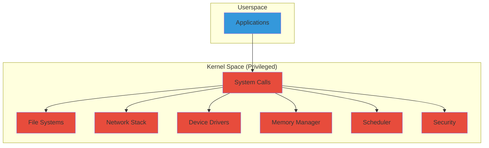
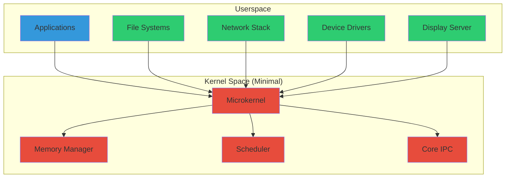
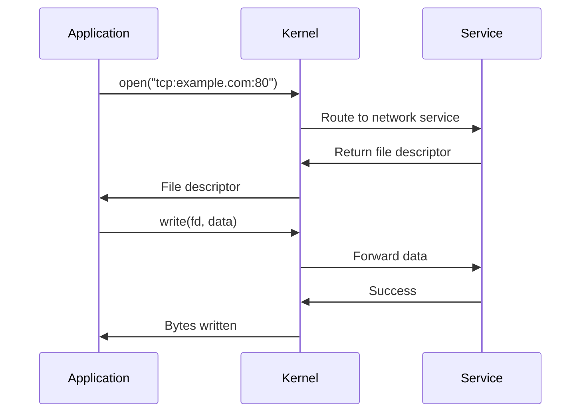
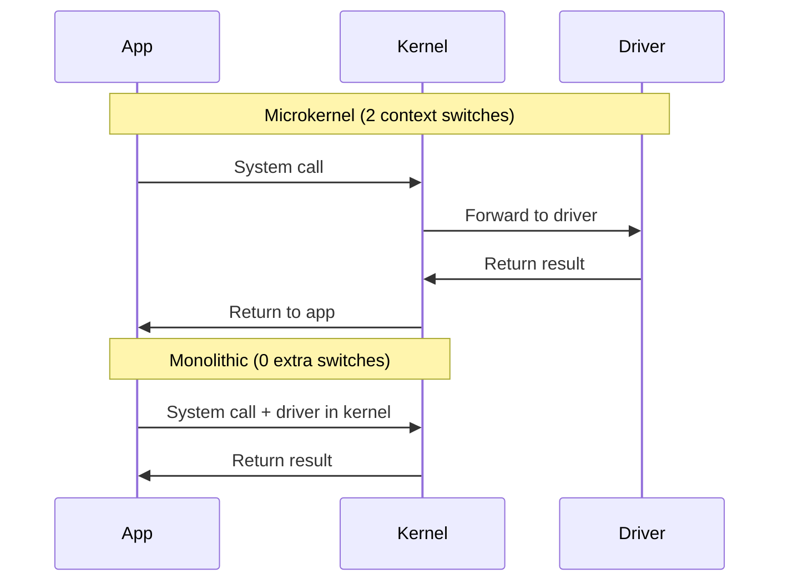
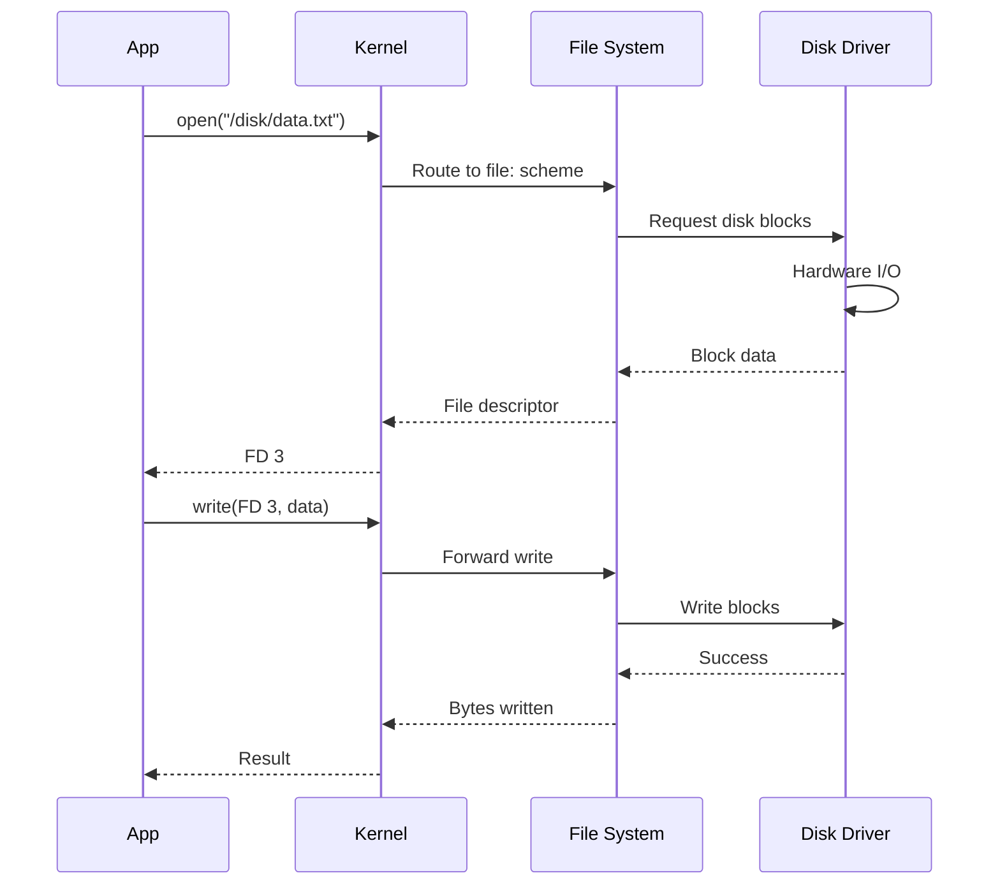

## What is a Microkernel?

A microkernel is a minimalist approach to operating system design where the kernel provides only the most essential services:

- **Process and thread management**
- **Memory management** (virtual memory, paging)
- **Inter-process communication** (IPC)
- **Basic I/O and interrupt handling**

All other services—device drivers, file systems, network stacks—run in userspace as separate processes.

<Info>
The Redox kernel is approximately 20,000 lines of code, compared to the Linux kernel's 20+ million lines.
</Info>

## Microkernel vs Monolithic Kernel

### Monolithic Architecture (Linux, BSD)



**Characteristics:**
- Everything runs in kernel mode with full privileges
- Fast: minimal context switches
- Less secure: any bug can crash the system
- Complex: tight coupling between components

### Microkernel Architecture (Redox)



**Characteristics:**
- Minimal kernel with most services in userspace
- Strong isolation between components
- More secure: bugs are contained
- Modular: easy to replace components

<Tip>
Microkernel design trades some performance for significantly improved reliability, security, and maintainability.
</Tip>

## Redox Microkernel Features

### 1. Process Management

The kernel manages processes with minimal overhead:

```rust
// Kernel provides basic process primitives
pub struct Process {
    pid: ProcessId,
    memory: AddressSpace,
    threads: Vec<Thread>,
    scheme_namespace: SchemeNamespace,
    // Minimal state
}
```

<CardGroup cols={2}>
  <Card title="Process Creation" icon="plus">
    Efficient `fork()` and `exec()` system calls with copy-on-write memory
  </Card>
  <Card title="Process Isolation" icon="shield">
    Each process has its own address space and scheme namespace
  </Card>
</CardGroup>

### 2. Memory Management

The kernel handles virtual memory and paging:

- **Virtual address spaces**: Each process has isolated memory
- **Demand paging**: Pages loaded on access
- **Copy-on-write**: Efficient `fork()` implementation
- **Memory mapping**: `mmap()` for file and device access

```rust
// Kernel memory management interface
pub trait MemoryScheme {
    fn allocate(&mut self, size: usize) -> Result<PhysicalAddress>;
    fn map(&mut self, virt: VirtualAddress, phys: PhysicalAddress) -> Result<()>;
    fn unmap(&mut self, virt: VirtualAddress) -> Result<()>;
}
```

### 3. Inter-Process Communication (IPC)

Redox uses **schemes** as the primary IPC mechanism:



<AccordionGroup>
  <Accordion title="Scheme-based IPC">
    Applications communicate with services through scheme URLs like `tcp:`, `file:`, `display:`
  </Accordion>
  
  <Accordion title="Shared Memory">
    High-performance IPC using `shm:` scheme for large data transfers
  </Accordion>
  
  <Accordion title="Message Passing">
    Channel-based communication using `chan:` scheme
  </Accordion>
  
  <Accordion title="Unix Sockets">
    POSIX-compatible `uds_stream:` and `uds_dgram:` schemes
  </Accordion>
</AccordionGroup>

### 4. Scheduling

The kernel implements a round-robin scheduler with priorities:

```rust
// Simplified scheduler logic
loop {
    let next_thread = scheduler.select_next();
    context_switch(current_thread, next_thread);
    current_thread = next_thread;
}
```

<Note>
Redox's scheduler is preemptive and supports multiple CPU cores with load balancing.
</Note>

## Advantages of Microkernel Design

### 1. Fault Isolation and Reliability

<Tabs>
  <Tab title="Microkernel">
    ```bash
    # Driver crash in Redox
    $ ls /disk/file
    # Driver crashes
    [kernel] Driver 'disk' crashed, restarting...
    # System continues running
    $ ls /disk/file  # Works after restart
    ```
  </Tab>
  <Tab title="Monolithic">
    ```bash
    # Driver crash in Linux
    $ ls /mnt/disk
    # Driver crashes
    [kernel panic] Unable to handle kernel NULL pointer dereference
    # System freezes or reboots
    ```
  </Tab>
</Tabs>

<Warning>
In monolithic kernels, a single driver bug can crash the entire system. In Redox, driver crashes are isolated and recoverable.
</Warning>

### 2. Security Through Least Privilege

Each service runs with minimal permissions:

```toml
# User permissions from base.toml
[user_schemes.user]
schemes = [
  # Kernel schemes (limited)
  "debug", "event", "memory", "pipe",
  
  # Utility schemes
  "rand", "null", "zero", "log",
  
  # Network schemes
  "ip", "icmp", "tcp", "udp",
  
  # File access
  "file",
  
  # User interfaces
  "pty", "audio", "orbital"
]
```

### 3. Modularity and Maintainability

<Steps>
  <Step title="Independent Development">
    Services can be developed and tested separately from the kernel
  </Step>
  <Step title="Easy Updates">
    Update individual services without rebuilding the kernel
  </Step>
  <Step title="Component Replacement">
    Swap implementations (e.g., replace file system) without kernel changes
  </Step>
  <Step title="Simplified Debugging">
    Debug services with standard userspace tools
  </Step>
</Steps>

### 4. Memory Safety with Rust

Redox leverages Rust's memory safety guarantees:

```rust
// This won't compile - Rust prevents use-after-free
let data = vec![1, 2, 3];
let reference = &data[0];
drop(data);  // Error: cannot move out of `data` while borrowed
println!("{}", reference);
```

<CardGroup cols={2}>
  <Card title="No Buffer Overflows" icon="shield-check">
    Rust's bounds checking prevents buffer overruns
  </Card>
  <Card title="No Null Pointers" icon="ban">
    Rust's `Option` type eliminates null pointer dereferences
  </Card>
  <Card title="No Data Races" icon="lock">
    Rust's ownership system prevents concurrent access bugs
  </Card>
  <Card title="No Use-After-Free" icon="trash">
    Rust's lifetime system ensures memory is valid
  </Card>
</CardGroup>

## Performance Considerations

### Context Switch Overhead

Microkernel architectures require more context switches:



<Tip>
Modern optimizations like message batching, zero-copy transfers, and efficient IPC mechanisms minimize the performance impact of context switches.
</Tip>

### Optimization Techniques

<AccordionGroup>
  <Accordion title="Shared Memory IPC">
    Use `shm:` scheme for high-bandwidth data transfers without copying
  </Accordion>
  
  <Accordion title="Message Batching">
    Group multiple operations into single IPC messages
  </Accordion>
  
  <Accordion title="Zero-Copy">
    Direct memory mapping for network and disk I/O
  </Accordion>
  
  <Accordion title="Fast System Calls">
    Optimized syscall interface with minimal overhead
  </Accordion>
</AccordionGroup>

## Kernel System Calls

Redox provides a minimal set of system calls:

```rust
// Core system calls in Redox kernel
pub enum SysCall {
    // Process management
    Exit(usize),
    Fork,
    Exec { path: &str, args: &[&str] },
    
    // Memory management
    Mmap { addr: usize, size: usize, flags: MapFlags },
    Munmap { addr: usize, size: usize },
    
    // Scheme operations
    Open { path: &str, flags: OpenFlags },
    Close { fd: FileDescriptor },
    Read { fd: FileDescriptor, buf: &mut [u8] },
    Write { fd: FileDescriptor, buf: &[u8] },
    
    // IPC
    Pipe { fds: &mut [FileDescriptor; 2] },
    Clone { flags: CloneFlags },
    Yield,
}
```

<Note>
All I/O operations go through scheme handlers, not directly through the kernel.
</Note>

## Real-World Example: Disk Access

Here's how disk access works in Redox's microkernel:

```rust
// Application code
use std::fs::File;
use std::io::Write;

fn main() -> std::io::Result<()> {
    // 1. App opens file (scheme: "file:/path/to/file")
    let mut file = File::create("/disk/data.txt")?;
    
    // 2. Kernel routes to file system service
    // 3. File system service routes to disk driver
    // 4. Disk driver performs hardware I/O
    
    file.write_all(b"Hello, Redox!")?;
    Ok(())
}
```



## Comparison with Other Microkernels

| Feature | Redox | MINIX 3 | seL4 | QNX |
|---------|-------|---------|------|-----|
| **Language** | Rust | C | C | C |
| **Memory Safety** | Yes | No | Verified | No |
| **License** | MIT | BSD | GPLv2/Commercial | Commercial |
| **POSIX Support** | Via relibc | Yes | Limited | Yes |
| **Target Use** | General purpose | Education/Embedded | Critical systems | Real-time/Embedded |
| **IPC Mechanism** | Schemes | Messages | Endpoints | Messages |

<Tip>
Redox combines the safety of Rust with the elegance of Plan 9's everything-is-a-file design, creating a modern, secure microkernel OS.
</Tip>

## Next Steps

<CardGroup cols={2}>
  <Card title="System Components" icon="cubes" href="/architecture/components">
    Learn about userspace services and components
  </Card>
  <Card title="Scheme System" icon="link" href="/architecture/schemes">
    Understand Redox's everything-is-a-URL design
  </Card>
</CardGroup>
