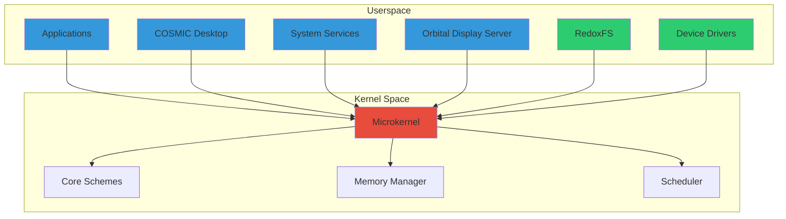
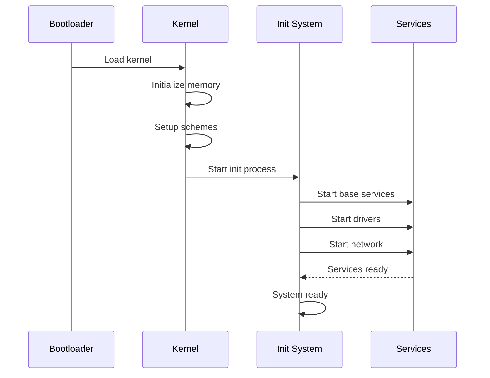

## What is Redox OS?

Redox is an open-source operating system written in Rust, a language with focus on safety, efficiency and high performance. Redox uses a **microkernel architecture**, and aims to be reliable, secure, usable, correct, and free.

<Info>
Redox is inspired by previous operating systems, such as seL4, MINIX, Plan 9, Linux and BSD.
</Info>

## Design Philosophy

Redox is not just a kernel—it's a **full-featured operating system** that provides:

- File system (RedoxFS)
- Display server (Orbital)
- Core utilities
- C POSIX library (relibc)
- Shell (Ion)
- Package manager (pkgutils)

### Core Principles

<CardGroup cols={2}>
  <Card title="Safety" icon="shield">
    Written entirely in Rust to prevent common security vulnerabilities like buffer overflows and memory corruption
  </Card>
  <Card title="Microkernel" icon="cube">
    Minimal kernel with most services running in userspace for better isolation and reliability
  </Card>
  <Card title="Unix-like" icon="terminal">
    Provides source code compatibility with many Rust, Linux and BSD programs through relibc
  </Card>
  <Card title="Everything is a URL" icon="link">
    Unique scheme system where all resources are accessed through URL-like paths
  </Card>
</CardGroup>

## Architecture Diagram



## Key Components

### Kernel

The Redox kernel is a microkernel that provides:

- Process and thread management
- Memory management
- Inter-process communication (IPC)
- Basic schemes (debug, event, memory, pipe, irq, time, sys)
- Context switching and scheduling

<Note>
Unlike monolithic kernels, the Redox microkernel runs with minimal privileges and delegates most functionality to userspace services.
</Note>

### System Services

Most operating system functionality runs in userspace:

- **File systems**: RedoxFS and other file system drivers
- **Network stack**: smolnetd (TCP/IP, UDP, ICMP)
- **Device drivers**: Graphics, USB, disk controllers
- **Display server**: Orbital (window management)
- **IPC services**: Shared memory, channels, Unix domain sockets

### Libraries

<AccordionGroup>
  <Accordion title="relibc - C Standard Library">
    Redox's C standard library, written in Rust, providing POSIX compatibility for porting applications from Linux and BSD.
  </Accordion>
  
  <Accordion title="libredox - Redox System Library">
    Rust library for accessing Redox-specific functionality and schemes.
  </Accordion>
  
  <Accordion title="redox-scheme - Scheme Protocol">
    Library for implementing scheme providers (resource handlers).
  </Accordion>
</AccordionGroup>

## Comparison: Microkernel vs Monolithic

| Aspect | Microkernel (Redox) | Monolithic (Linux) |
|--------|---------------------|--------------------|
| **Kernel Size** | Small (~20K LOC) | Large (>20M LOC) |
| **Services Location** | Userspace | Kernel space |
| **Driver Crashes** | Isolated, recoverable | Can crash entire system |
| **Security** | Strong isolation | Shared kernel space |
| **Performance** | Context switches overhead | Direct kernel calls |
| **Development** | Safer, modular | Complex, interdependent |

<Warning>
Microkernel architectures trade some performance for improved reliability and security. Context switches between userspace and kernel space have overhead, but modern optimizations minimize this impact.
</Warning>

## Benefits of Redox's Architecture

### 1. Fault Isolation

If a driver or service crashes, it doesn't bring down the entire system. The microkernel can detect the failure and potentially restart the service.

```rust
// Example: A crashed driver doesn't affect other components
if driver_process.crashed() {
    log::error!("Driver {} crashed, restarting...", driver_name);
    restart_service(driver_name);
}
```

### 2. Memory Safety

Written in Rust, Redox prevents entire classes of vulnerabilities:

- Buffer overflows
- Use-after-free
- Null pointer dereferences
- Data races

### 3. Modularity

Components can be developed, tested, and updated independently:

```bash
# Update just the network stack
pkg update smolnetd

# Replace the file system driver
pkg install ramfs
```

### 4. Security Through Isolation

Each service runs with minimal privileges:

```toml
# From base.toml - User scheme permissions
[user_schemes.user]
schemes = [
  "debug", "event", "memory", "pipe",
  "rand", "null", "zero", "log",
  "ip", "tcp", "udp", "file",
  "pty", "audio", "orbital"
]
```

## System Initialization

Redox boots through a well-defined initialization sequence:



<Steps>
  <Step title="Bootloader">
    Loads the kernel into memory and transfers control
  </Step>
  <Step title="Kernel Initialization">
    Sets up memory management, scheduler, and core schemes
  </Step>
  <Step title="Init Scripts">
    Runs initialization scripts from `/usr/lib/init.d/`
  </Step>
  <Step title="Service Startup">
    Starts essential services (ipcd, ptyd, drivers)
  </Step>
  <Step title="User Session">
    Launches display server and user applications
  </Step>
</Steps>

## Next Steps

<CardGroup cols={2}>
  <Card title="Microkernel Design" icon="cube" href="/architecture/microkernel">
    Deep dive into the microkernel architecture
  </Card>
  <Card title="System Components" icon="cubes" href="/architecture/components">
    Explore major system components
  </Card>
  <Card title="Scheme System" icon="link" href="/architecture/schemes">
    Learn about Redox's everything-is-a-URL design
  </Card>
  <Card title="Contributing" icon="code" href="/development/contributing">
    Start contributing to Redox OS
  </Card>
</CardGroup>
