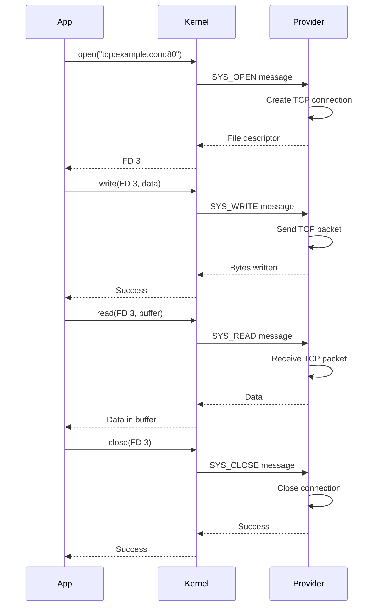

## What are Schemes?

Schemes are Redox's unified resource access mechanism. Similar to Plan 9's "everything is a file" philosophy, Redox takes it further with **"everything is a URL"**.

<Info>
In Redox, all resources—files, network connections, devices, IPC—are accessed through URL-like paths called schemes.
</Info>

### Scheme Syntax

```text
scheme:[path]

Examples:
file:/path/to/file.txt
tcp:example.com:80
display:0/input
pty:
rand:
memory:0x1000/0x100
```

## Scheme Architecture

```mermaid
graph TB
    subgraph "Application Layer"
        A[Application]
    end
    
    subgraph "Library Layer"
        B[relibc/libredox]
    end
    
    subgraph "Kernel Layer"
        C[Kernel Scheme Router]
        D[Scheme Namespace]
    end
    
    subgraph "Scheme Providers"
        E[file: - RedoxFS]
        F[tcp: - Network]
        G[display: - Orbital]
        H[rand: - RNG]
    end
    
    A -->|open("tcp:example.com:80")| B
    B --> C
    C --> D
    D -->|Route request| F
    F -->|Return fd| D
    D --> C
    C --> B
    B --> A
    
    style C fill:#e74c3c
    style A fill:#3498db
    style E fill:#2ecc71
    style F fill:#2ecc71
    style G fill:#2ecc71
    style H fill:#2ecc71
```

## How Schemes Work

### Opening a Resource

```rust
use std::fs::File;

// Opens file: scheme
let file = File::open("/file/document.txt")?;

// Internally translates to:
// open("file:/document.txt", O_RDONLY)
```

<Steps>
  <Step title="Application Request">
    Application calls `open("tcp:example.com:80")`
  </Step>
  <Step title="Library Translation">
    relibc/libredox parses the URL and makes a syscall
  </Step>
  <Step title="Kernel Routing">
    Kernel routes the request to the `tcp:` scheme provider
  </Step>
  <Step title="Scheme Handler">
    Network service handles the request and returns a file descriptor
  </Step>
  <Step title="Return to Application">
    Application receives a file descriptor to read/write
  </Step>
</Steps>

### Scheme Communication Flow



## Built-in Schemes

Redox provides many built-in schemes for different purposes:

### Kernel Schemes

Provided directly by the kernel:

<Tabs>
  <Tab title="Core">
    ```rust
    // debug: - Kernel debug output
    let mut debug = File::create("debug:")?;
    writeln!(debug, "Debug message")?;
    
    // event: - Event notification
    let event = File::open("event:")?;
    
    // time: - System time
    let time = File::open("time:")?;
    
    // sys: - System information
    let sys = File::open("sys:context")?;
    ```
  </Tab>
  <Tab title="Memory">
    ```rust
    // memory: - Physical memory access (root only)
    let mem = File::open("memory:0x1000/0x100")?;
    //                     address ^    ^ length
    
    // pipe: - Anonymous pipes
    use std::os::unix::io::AsRawFd;
    let (read, write) = syscall::pipe2(0)?;
    ```
  </Tab>
  <Tab title="Hardware">
    ```rust
    // irq: - Interrupt handling
    let irq = File::open("irq:5")?;
    
    // serio: - Serial I/O
    let serial = File::open("serio:com1")?;
    ```
  </Tab>
</Tabs>

### File Schemes

File system access:

```rust
// file: - Main file system
let file = File::open("file:/home/user/document.txt")?;

// Or using Unix-style paths (automatic translation)
let file = File::open("/home/user/document.txt")?;
//                    ^ becomes file:/home/user/document.txt
```

<Note>
Paths starting with `/` are automatically converted to `file:` scheme URLs by relibc.
</Note>

### Network Schemes

Provided by smolnetd:

<Tabs>
  <Tab title="TCP">
    ```rust
    use std::net::TcpStream;
    use std::io::{Read, Write};
    
    // Connects via tcp: scheme
    let mut stream = TcpStream::connect("example.com:80")?;
    
    // HTTP request
    stream.write_all(b"GET / HTTP/1.1\r\n")?;
    stream.write_all(b"Host: example.com\r\n")?;
    stream.write_all(b"\r\n")?;
    
    let mut response = String::new();
    stream.read_to_string(&mut response)?;
    ```
  </Tab>
  <Tab title="UDP">
    ```rust
    use std::net::UdpSocket;
    
    // Binds via udp: scheme
    let socket = UdpSocket::bind("0.0.0.0:8080")?;
    
    // Send datagram
    socket.send_to(b"Hello", "192.168.1.1:8080")?;
    
    // Receive datagram
    let mut buf = [0u8; 1024];
    let (len, addr) = socket.recv_from(&mut buf)?;
    ```
  </Tab>
  <Tab title="ICMP">
    ```rust
    use std::fs::File;
    use std::io::Write;
    
    // Raw ICMP access via icmp: scheme
    let mut socket = File::create("icmp:")?;
    
    // Send ping packet
    let ping = [8, 0, 0, 0, 0, 1, 0, 1]; // ICMP echo
    socket.write_all(&ping)?;
    ```
  </Tab>
  <Tab title="IP">
    ```rust
    // Raw IP socket access
    let socket = File::open("ip:192.168.1.1")?;
    ```
  </Tab>
</Tabs>

### Device Schemes

Hardware device access:

```bash
# Device symlinks from base.toml
/dev/null    -> /scheme/null     # Null device
/dev/random  -> /scheme/rand     # Random numbers
/dev/urandom -> /scheme/rand     # Random numbers
/dev/zero    -> /scheme/zero     # Zero bytes
```

```rust
// rand: - Random number generator
use std::fs::File;
use std::io::Read;

let mut rng = File::open("rand:")?;
let mut random_bytes = [0u8; 32];
rng.read_exact(&mut random_bytes)?;

// null: - Discard all writes
let mut null = File::create("null:")?;
null.write_all(b"This data disappears")?;

// zero: - Infinite zero bytes
let mut zero = File::open("zero:")?;
let mut zeros = [0u8; 1024];
zero.read_exact(&mut zeros)?; // All zeros
```

### IPC Schemes

Inter-process communication:

<AccordionGroup>
  <Accordion title="shm: - Shared Memory">
    ```rust
    use std::fs::File;
    use std::io::{Read, Write};
    
    // Create shared memory region
    let mut shm = File::create("shm:my-region")?;
    shm.write_all(b"Shared data")?;
    
    // Another process can access it
    let mut shm = File::open("shm:my-region")?;
    let mut data = String::new();
    shm.read_to_string(&mut data)?;
    ```
  </Accordion>
  
  <Accordion title="chan: - Channels">
    ```rust
    // Message passing between processes
    let tx = File::create("chan:messages")?;
    let rx = File::open("chan:messages")?;
    
    // Send message
    tx.write_all(b"Hello from sender")?;
    
    // Receive message
    let mut msg = String::new();
    rx.read_to_string(&mut msg)?;
    ```
  </Accordion>
  
  <Accordion title="uds_stream: - Unix Domain Sockets (Stream)">
    ```rust
    use std::os::unix::net::UnixStream;
    
    // Connect to Unix socket
    let stream = UnixStream::connect("/tmp/socket")?;
    ```
  </Accordion>
  
  <Accordion title="uds_dgram: - Unix Domain Sockets (Datagram)">
    ```rust
    use std::os::unix::net::UnixDatagram;
    
    // Create datagram socket
    let socket = UnixDatagram::bind("/tmp/socket")?;
    ```
  </Accordion>
</AccordionGroup>

### Display Schemes

Graphics and display access:

```rust
// display: - Direct framebuffer access
let mut display = File::open("display:0")?;

// orbital: - Window management
use orbclient::{Color, Renderer, Window};

let mut window = Window::new(
    100, 100, 800, 600,
    "My Application"
)?;

window.set(Color::rgb(255, 0, 0));
window.sync();
```

### Terminal Schemes

```rust
// pty: - Pseudo-terminal
use std::fs::File;

let pty = File::open("pty:")?;
// Returns master and slave PTY pair
```

### Other Schemes

<CardGroup cols={2}>
  <Card title="sudo:" icon="user-shield">
    Privilege escalation for authorized users
  </Card>
  <Card title="audio:" icon="volume-up">
    Audio device access
  </Card>
  <Card title="log:" icon="file-lines">
    System logging
  </Card>
</CardGroup>

## Scheme Permissions

Schemes have fine-grained permission control:

```toml
# From base.toml - User scheme permissions
[user_schemes.root]
schemes = ["*"]  # Root has access to all schemes

[user_schemes.user]
schemes = [
  # Kernel schemes
  "debug", "event", "memory", "pipe", "serio", "irq", "time", "sys",
  
  # Base schemes
  "rand", "null", "zero", "log",
  
  # Network schemes
  "ip", "icmp", "tcp", "udp",
  
  # IPC schemes
  "shm", "chan", "uds_stream", "uds_dgram",
  
  # File schemes
  "file",
  
  # Display schemes
  "display.vesa", "display*",
  
  # Other schemes
  "pty", "sudo", "audio", "orbital",
]
```

<Warning>
Users can only access schemes explicitly granted in their permission list. Attempting to access unauthorized schemes results in "Permission denied" errors.
</Warning>

## Implementing a Scheme Provider

You can implement custom scheme providers:

```rust
use redox_scheme::{Scheme, Response};
use syscall::{Error, Result, EBADF, EINVAL};
use std::collections::BTreeMap;

struct MyScheme {
    next_fd: usize,
    handles: BTreeMap<usize, Vec<u8>>,
}

impl MyScheme {
    fn new() -> Self {
        MyScheme {
            next_fd: 0,
            handles: BTreeMap::new(),
        }
    }
}

impl Scheme for MyScheme {
    fn open(&mut self, path: &str, _flags: usize, _uid: u32, _gid: u32) -> Result<usize> {
        // Create new handle
        let fd = self.next_fd;
        self.next_fd += 1;
        
        self.handles.insert(fd, Vec::new());
        Ok(fd)
    }
    
    fn read(&mut self, id: usize, buf: &mut [u8]) -> Result<usize> {
        if let Some(data) = self.handles.get_mut(&id) {
            let len = std::cmp::min(buf.len(), data.len());
            buf[..len].copy_from_slice(&data[..len]);
            data.drain(..len);
            Ok(len)
        } else {
            Err(Error::new(EBADF))
        }
    }
    
    fn write(&mut self, id: usize, buf: &[u8]) -> Result<usize> {
        if let Some(data) = self.handles.get_mut(&id) {
            data.extend_from_slice(buf);
            Ok(buf.len())
        } else {
            Err(Error::new(EBADF))
        }
    }
    
    fn close(&mut self, id: usize) -> Result<usize> {
        self.handles.remove(&id).ok_or(Error::new(EBADF))?;
        Ok(0)
    }
    
    // Implement other methods as needed...
}

fn main() {
    // Register scheme with kernel
    let mut scheme = MyScheme::new();
    let socket = syscall::open(
        ":myscheme",
        syscall::O_RDWR | syscall::O_CREAT
    ).expect("Failed to create scheme");
    
    // Handle scheme requests
    loop {
        let mut packet = syscall::Packet::default();
        syscall::read(socket, &mut packet).expect("Failed to read packet");
        
        let response = scheme.handle(&packet);
        syscall::write(socket, &response).expect("Failed to write response");
    }
}
```

<Steps>
  <Step title="Implement Scheme Trait">
    Implement the `Scheme` trait with handlers for open, read, write, close, etc.
  </Step>
  <Step title="Register with Kernel">
    Open a special path (`:schemename`) to register your scheme
  </Step>
  <Step title="Handle Requests">
    Loop reading packets from the kernel and responding
  </Step>
  <Step title="Run as Service">
    Run your scheme provider as a system service
  </Step>
</Steps>

## Scheme Namespaces

Processes can have their own scheme namespaces:

```rust
// Process A might see:
// file: -> RedoxFS on /dev/sda1

// Process B (in container) might see:
// file: -> Different filesystem
// tcp: -> Virtual network
```

<Info>
Scheme namespaces enable containerization and sandboxing in Redox.
</Info>

## Advantages of Scheme System

### 1. Unified Interface

All resources use the same API:

```rust
use std::fs::File;
use std::io::{Read, Write};

// Same code pattern for different resources
fn read_resource(url: &str) -> std::io::Result<String> {
    let mut file = File::open(url)?;
    let mut content = String::new();
    file.read_to_string(&mut content)?;
    Ok(content)
}

// Works with any scheme
let file_data = read_resource("file:/data.txt")?;
let network_data = read_resource("tcp:api.example.com:80")?;
let random_data = read_resource("rand:")?;
```

### 2. Flexibility

<CardGroup cols={2}>
  <Card title="Pluggable" icon="plug">
    Replace scheme implementations without changing applications
  </Card>
  <Card title="Virtual" icon="layer-group">
    Create virtual resources (e.g., virtual file systems)
  </Card>
  <Card title="Remote" icon="network-wired">
    Access remote resources transparently
  </Card>
  <Card title="Composable" icon="cubes">
    Combine schemes for powerful abstractions
  </Card>
</CardGroup>

### 3. Security

Fine-grained access control:

```rust
// User can only access permitted schemes
// Attempt to access unauthorized scheme:
let result = File::open("memory:0x1000");
// Error: Permission denied
```

### 4. Network Transparency

```rust
// Local file
let file = File::open("file:/local/data.txt")?;

// Could be extended for remote files
let file = File::open("nfs:server.example.com/data.txt")?;
// Same API, different backend
```

## Comparison with Traditional Unix

| Aspect | Unix /dev | Redox Schemes |
|--------|-----------|---------------|
| **Syntax** | `/dev/sda1` | `disk:0/1` or `/dev/sda1` |
| **Network** | Sockets API | `tcp:host:port` |
| **IPC** | Separate APIs | `chan:name`, `shm:name` |
| **Flexibility** | Fixed paths | URL-based, flexible |
| **Permissions** | File permissions | Scheme permissions |
| **Namespaces** | Mount points | Scheme namespaces |

## Practical Examples

### Example 1: HTTP Client

```rust
use std::io::{BufRead, BufReader, Write};
use std::net::TcpStream;

fn http_get(host: &str, path: &str) -> std::io::Result<String> {
    // Connect via tcp: scheme
    let mut stream = TcpStream::connect(format!("{}:80", host))?;
    
    // Send HTTP request
    write!(stream, "GET {} HTTP/1.1\r\n", path)?;
    write!(stream, "Host: {}\r\n", host)?;
    write!(stream, "Connection: close\r\n\r\n")?;
    
    // Read response
    let reader = BufReader::new(stream);
    let mut response = String::new();
    
    for line in reader.lines() {
        response.push_str(&line?);
        response.push('\n');
    }
    
    Ok(response)
}

fn main() {
    match http_get("example.com", "/") {
        Ok(response) => println!("Response:\n{}", response),
        Err(e) => eprintln!("Error: {}", e),
    }
}
```

### Example 2: Device Access

```rust
use std::fs::File;
use std::io::{Read, Write};

fn generate_random_file(path: &str, size: usize) -> std::io::Result<()> {
    // Read from random device
    let mut rng = File::open("rand:")?;
    let mut random_data = vec![0u8; size];
    rng.read_exact(&mut random_data)?;
    
    // Write to file
    let mut file = File::create(path)?;
    file.write_all(&random_data)?;
    
    Ok(())
}

fn main() {
    generate_random_file("/file/random.bin", 1024)
        .expect("Failed to generate random file");
}
```

### Example 3: IPC Communication

```rust
use std::fs::File;
use std::io::{Read, Write};
use std::thread;

fn main() {
    // Create shared memory region
    let mut sender = File::create("shm:example").unwrap();
    
    // Spawn receiver thread
    let receiver = thread::spawn(move || {
        let mut shm = File::open("shm:example").unwrap();
        let mut data = String::new();
        shm.read_to_string(&mut data).unwrap();
        println!("Received: {}", data);
    });
    
    // Send data
    sender.write_all(b"Hello from sender!").unwrap();
    
    receiver.join().unwrap();
}
```

## Next Steps

<CardGroup cols={2}>
  <Card title="Architecture Overview" icon="diagram-project" href="/architecture/overview">
    Return to architecture overview
  </Card>
  <Card title="System Components" icon="cubes" href="/architecture/components">
    Learn about system components
  </Card>
  <Card title="Build System" icon="hammer" href="/getting-started/building">
    Build Redox from source
  </Card>
  <Card title="Contributing" icon="code" href="/contributing">
    Contribute to Redox OS
  </Card>
</CardGroup>
