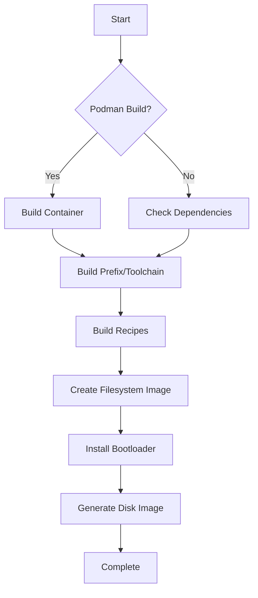

## Introduction

The Redox OS build system is a sophisticated modular build infrastructure that supports multiple build methods, architectures, and configurations. It orchestrates the compilation of the kernel, userspace applications, and system images through a combination of Makefiles, shell scripts, and Rust-based tools.

## Build System Architecture

The build system is organized into several key components:

### Core Components

<CardGroup cols={2}>
  <Card title="Makefile System" icon="gear">
    Modular Makefiles in the `mk/` directory handle different aspects of the build process
  </Card>
  <Card title="Recipe System" icon="book">
    Cookbook-based package management for building and installing software packages
  </Card>
  <Card title="Configuration" icon="sliders">
    TOML-based configuration files defining system variants and package sets
  </Card>
  <Card title="Bootstrap Scripts" icon="rocket">
    Automated setup scripts for both Podman and native build environments
  </Card>
</CardGroup>

### Makefile Structure

The build system consists of multiple specialized Makefiles:

```bash
mk/
├── config.mk        # Build system configuration and environment variables
├── podman.mk        # Podman container build configuration
├── prefix.mk        # Cross-compiler toolchain recipes
├── repo.mk          # Recipe/package management commands
├── disk.mk          # Disk image creation and mounting
├── qemu.mk          # QEMU emulation configuration
├── virtualbox.mk    # VirtualBox configuration
├── fstools.mk       # Filesystem tools compilation
├── depends.mk       # Build dependencies
└── ci.mk            # Continuous integration targets
```

## Build Methods

### Podman Build (Recommended)

The Podman build method uses containerization to provide a consistent, isolated build environment:

<Steps>
  <Step title="Container Setup">
    Creates a Podman container with all build dependencies pre-installed
  </Step>
  <Step title="Isolated Environment">
    Ensures reproducible builds across different host systems
  </Step>
  <Step title="Automatic Configuration">
    Configures `PODMAN_BUILD=1` in `.config` file
  </Step>
</Steps>

**Advantages:**
- Consistent build environment across all platforms
- No host system pollution
- Easy to reproduce builds
- Faster setup on systems with package manager support

### Native Build

The native build method compiles directly on the host system:

<Steps>
  <Step title="Dependency Installation">
    Installs toolchain and dependencies on the host system
  </Step>
  <Step title="Direct Compilation">
    Builds components using host-installed tools
  </Step>
  <Step title="Manual Configuration">
    Requires manual management of build dependencies
  </Step>
</Steps>

**Advantages:**
- Direct access to build artifacts
- Faster iteration during development
- Better IDE integration
- Lower memory overhead

## Build Targets

### Primary Targets

<AccordionGroup>
  <Accordion title="all (default)" icon="bullseye">
    Builds the complete hard drive image at `build/$(ARCH)/$(CONFIG_NAME)/harddrive.img`
    
    ```bash
    make all
    ```
  </Accordion>
  
  <Accordion title="live" icon="compact-disc">
    Creates a bootable live ISO image
    
    ```bash
    make live
    ```
  </Accordion>
  
  <Accordion title="image" icon="hard-drive">
    Rebuilds the hard drive image from scratch (unmounts first)
    
    ```bash
    make image
    ```
  </Accordion>
  
  <Accordion title="rebuild" icon="arrows-rotate">
    Cleans repo tag and rebuilds everything
    
    ```bash
    make rebuild
    ```
  </Accordion>
</AccordionGroup>

### Package Management Targets

The build system provides shorthand commands for working with recipes:

| Target Pattern | Description | Example |
|----------------|-------------|----------|
| `r.PACKAGE` | Cook (build) a package | `make r.orbital` |
| `c.PACKAGE` | Clean a package | `make c.kernel` |
| `f.PACKAGE` | Fetch package sources | `make f.gcc` |
| `p.PACKAGE` | Push package to image | `make p.shell` |
| `cr.PACKAGE` | Clean and rebuild | `make cr.relibc` |
| `rp.PACKAGE` | Build and push | `make rp.nano` |

<Tip>
  You can operate on multiple packages by separating them with commas: `make r.gcc,binutils,newlib`
</Tip>

### Emulation Targets

```bash
# Run with QEMU (various options)
make qemu           # Default QEMU settings
make qemu kvm=yes   # Enable KVM acceleration
make qemu gpu=virtio # Use VirtIO GPU

# Run with VirtualBox
make virtualbox
```

## Build Artifacts

The build system generates artifacts in the `build/` directory:

```
build/
├── $(ARCH)/
│   └── $(CONFIG_NAME)/
│       ├── harddrive.img      # Main disk image
│       ├── redox-live.iso     # Live bootable ISO
│       ├── filesystem/        # Mounted filesystem
│       ├── repo.tag           # Package build completion marker
│       └── bootloader-live.efi # UEFI bootloader
├── fstools/
│   └── bin/
│       ├── redoxfs            # Redox filesystem driver
│       ├── redoxfs-mkfs      # Filesystem creation tool
│       └── redox_installer   # System installer
├── container.tag              # Podman container marker (if using Podman)
└── podman/                    # Podman home directory
```

## Configuration Variables

Key environment variables that control the build:

<ParamField path="ARCH" type="string" default="x86_64">
  Target architecture: `x86_64`, `aarch64`, `i586`, or `riscv64gc`
</ParamField>

<ParamField path="CONFIG_NAME" type="string" default="desktop">
  Configuration profile: `desktop`, `server`, `minimal`, etc.
</ParamField>

<ParamField path="PODMAN_BUILD" type="integer" default="1">
  Enable (1) or disable (0) Podman-based builds
</ParamField>

<ParamField path="PREFIX_BINARY" type="integer" default="1">
  Use pre-built toolchain binaries (much faster)
</ParamField>

<ParamField path="REPO_BINARY" type="integer" default="0">
  Use pre-built package binaries instead of compiling from source
</ParamField>

<ParamField path="REPO_DEBUG" type="integer" default="0">
  Enable debug symbols and disable stripping
</ParamField>

## Build Workflow

A typical build follows this workflow:



<Steps>
  <Step title="Environment Setup">
    The build system checks for Podman or native dependencies and sets up the build environment
  </Step>
  
  <Step title="Toolchain Build">
    If needed, builds or downloads the cross-compilation toolchain for the target architecture
  </Step>
  
  <Step title="Recipe Compilation">
    Processes all recipes defined in the configuration file, building packages in dependency order
  </Step>
  
  <Step title="Filesystem Creation">
    Creates a RedoxFS filesystem image and populates it with compiled packages
  </Step>
  
  <Step title="Bootloader Installation">
    Installs the bootloader and creates the final bootable disk image
  </Step>
</Steps>

## Next Steps

<CardGroup cols={2}>
  <Card title="Podman Build" icon="docker" href="/build-system/podman-build">
    Set up a containerized build environment
  </Card>
  <Card title="Native Build" icon="terminal" href="/build-system/native-build">
    Build directly on your host system
  </Card>
  <Card title="Configuration" icon="sliders" href="/build-system/configuration">
    Customize your build settings
  </Card>
  <Card title="Recipes" icon="book" href="/build-system/recipes">
    Learn about the recipe system
  </Card>
</CardGroup>
