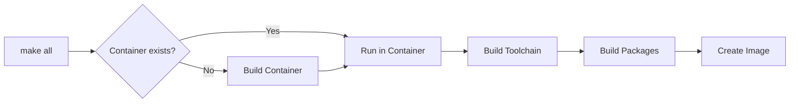

## Overview

The Podman build method is the **recommended approach** for building Redox OS. It provides a consistent, reproducible build environment by using containerization, eliminating issues caused by different host configurations.

<Info>
  **Why Podman?** Podman provides rootless containers with better security than traditional Docker, and it's the default containerization solution for Redox OS builds.
</Info>

## Prerequisites

### System Requirements

- **Operating System:** Linux, macOS, FreeBSD, or Windows WSL2
- **Memory:** At least 8GB RAM (16GB recommended)
- **Disk Space:** 20-30GB free space
- **Podman:** Version 3.0 or higher

### Required Software

<Tabs>
  <Tab title="Linux (Debian/Ubuntu)">
    ```bash
    sudo apt-get update
    sudo apt-get install podman curl git make pkg-config \
      fuse3 libfuse3-dev fuse-overlayfs slirp4netns gdb-multiarch
    ```
  </Tab>
  
  <Tab title="Linux (Fedora)">
    ```bash
    sudo dnf install podman curl git make fuse3 fuse3-devel \
      fuse-overlayfs slirp4netns gdb
    ```
  </Tab>
  
  <Tab title="Linux (Arch)">
    ```bash
    sudo pacman -S podman curl git make fuse3 fuse-overlayfs \
      slirp4netns gdb
    ```
  </Tab>
  
  <Tab title="macOS (Homebrew)">
    ```bash
    brew install podman git make curl
    ```
  </Tab>
  
  <Tab title="FreeBSD">
    ```bash
    sudo pkg install podman git gmake curl gdb
    ```
  </Tab>
</Tabs>

## Bootstrap Installation

Redox provides an automated bootstrap script that installs all dependencies and sets up the build environment.

### Using the Bootstrap Script

<Steps>
  <Step title="Download the Bootstrap Script">
    ```bash
    curl -sf https://gitlab.redox-os.org/redox-os/redox/raw/master/podman_bootstrap.sh -o podman_bootstrap.sh
    ```
  </Step>
  
  <Step title="Make it Executable">
    ```bash
    chmod +x podman_bootstrap.sh
    ```
  </Step>
  
  <Step title="Run the Bootstrap">
    For QEMU (recommended):
    ```bash
    ./podman_bootstrap.sh -e qemu
    ```
    
    For VirtualBox:
    ```bash
    ./podman_bootstrap.sh -e virtualbox
    ```
  </Step>
</Steps>

### What the Bootstrap Does

The `podman_bootstrap.sh` script performs these actions:

<AccordionGroup>
  <Accordion title="Dependency Installation" icon="download">
    - Detects your operating system
    - Installs Podman and required packages
    - Installs the selected emulator (QEMU or VirtualBox)
    - Sets up FUSE and overlay filesystem support
  </Accordion>
  
  <Accordion title="Rust Installation" icon="rust">
    - Checks for existing Rust installations
    - Offers to install rustup if not present
    - Configures the stable Rust toolchain
    - Updates PATH for cargo binaries
  </Accordion>
  
  <Accordion title="Repository Clone" icon="code-branch">
    - Clones the Redox OS repository from GitLab
    - Creates `.config` with `PODMAN_BUILD=1`
    - Sets up the directory structure
  </Accordion>
</AccordionGroup>

## Manual Setup

If you prefer to set up manually or the bootstrap script doesn't work for your system:

### 1. Clone the Repository

```bash
git clone https://gitlab.redox-os.org/redox-os/redox.git --origin upstream
cd redox
```

### 2. Create Configuration File

Create a `.config` file in the repository root:

```bash .config
PODMAN_BUILD?=1
```

Optional configuration for ARM64 Macs:
```bash .config
PODMAN_BUILD?=1
ARCH=aarch64
```

<Tip>
  Add `REPO_BINARY=1` to use pre-built packages for much faster builds (recommended for first-time users)
</Tip>

### 3. Install Rust

If you don't have Rust installed:

```bash
curl https://sh.rustup.rs -sSf | sh -s -- --default-toolchain stable -y
source $HOME/.cargo/env
```

## Building Redox OS

### Container Setup

The first time you run `make`, the build system will automatically create the Podman container:

```bash
make all
```

This process:
1. Builds a Podman image based on `podman/redox-base-containerfile`
2. Installs build dependencies inside the container
3. Sets up the Rust toolchain in the container
4. Creates a tag file at `build/container.tag`

<Warning>
  The initial container build can take 10-30 minutes depending on your internet connection and CPU speed.
</Warning>

### Build Process Flow

When using Podman builds, make targets automatically delegate to the container:



### Configuration Variables

The Podman build system uses several environment variables defined in `mk/podman.mk`:

<ParamField path="IMAGE_TAG" type="string" default="redox-base">
  Docker image tag for the Podman container
</ParamField>

<ParamField path="CONTAINER_WORKDIR" type="string" default="/mnt/redox">
  Working directory inside the container
</ParamField>

<ParamField path="USE_SELINUX" type="integer" default="1">
  Enable SELinux volume flags (`:Z`) for systems with SELinux
</ParamField>

<ParamField path="PODMAN_CACHE_PULL" type="integer" default="1">
  Pull cached layers from Docker Hub to speed up builds
</ParamField>

### Build Examples

<CodeGroup>
```bash Standard Build
# Build default configuration (desktop x86_64)
make all

# Run in QEMU
make qemu
```

```bash Server Configuration
# Set configuration in .config
echo 'CONFIG_NAME=server' >> .config

# Build and run
make all
make qemu
```

```bash ARM64 Build
# Configure for ARM64
echo 'ARCH=aarch64' >> .config

# Build
make all
```

```bash Minimal Build with Binaries
# Use pre-built packages for faster builds
echo 'REPO_BINARY=1' >> .config
echo 'CONFIG_NAME=minimal' >> .config

make all
```
</CodeGroup>

## Container Management

### Container Shell Access

To get a shell inside the build container:

```bash
make container_shell
```

This is useful for:
- Debugging build issues
- Inspecting build artifacts
- Running custom commands in the build environment

### Rebuilding the Container

If you need to rebuild the container (e.g., after updating the Containerfile):

```bash
make container_clean
make all
```

<Warning>
  `container_clean` will remove the container and all cached layers. The next build will take longer.
</Warning>

### Container Cleanup

```bash
# Remove container tag and home directory
make container_clean

# Force remove container image
podman image rm --force redox-base

# Complete Podman system reset (removes all images and containers)
podman system reset
```

## Podman Configuration Details

### Volume Mounts

The container mounts these volumes:

```bash
# Source code (with SELinux label)
$(ROOT):/mnt/redox:Z

# Podman home directory (persists cargo cache, etc.)
$(PODMAN_HOME):/root:Z
```

### Environment Variables

These variables are passed to the container:

```bash
# Build configuration
ARCH=$(ARCH)
BOARD=$(BOARD)
CONFIG_NAME=$(CONFIG_NAME)
FILESYSTEM_CONFIG=$(FILESYSTEM_CONFIG)
PREFIX_BINARY=$(PREFIX_BINARY)
REPO_BINARY=$(REPO_BINARY)
REPO_NONSTOP=$(REPO_NONSTOP)
REPO_OFFLINE=$(REPO_OFFLINE)

# Disable Podman inside container
PODMAN_BUILD=0

# CI and debugging
CI=$(CI)
COOKBOOK_LOGS=$(COOKBOOK_LOGS)
TESTBIN=$(TESTBIN)
```

### Container Capabilities

The container runs with these capabilities:

```bash
--cap-add SYS_ADMIN    # Required for FUSE mounting
--device /dev/fuse     # FUSE device access
--network=host         # Host network access
--pids-limit=-1        # Unlimited PIDs
```

## Filesystem Tools in Podman

By default, filesystem tools (redoxfs, redox_installer) run on the host. To run them inside Podman:

```bash .config
FSTOOLS_IN_PODMAN=1
```

<Info>
  Running filesystem tools in Podman requires proper FUSE support in your container environment.
</Info>

## Troubleshooting

<AccordionGroup>
  <Accordion title="Container fails to build" icon="triangle-exclamation">
    **Symptoms:** Error during `podman build` command
    
    **Solutions:**
    - Check your internet connection
    - Verify Podman is properly installed: `podman --version`
    - Try cleaning and rebuilding: `make container_clean && make all`
    - Check system logs: `journalctl -xe | grep podman`
  </Accordion>
  
  <Accordion title="FUSE permission errors" icon="lock">
    **Symptoms:** Cannot mount filesystem, permission denied
    
    **Solutions:**
    - Ensure FUSE is installed on host
    - Check FUSE device permissions: `ls -l /dev/fuse`
    - Verify user is in fuse group: `groups`
    - Try rootless Podman: `podman unshare cat /proc/self/uid_map`
  </Accordion>
  
  <Accordion title="SELinux issues" icon="shield">
    **Symptoms:** Volume mount errors on Fedora/RHEL
    
    **Solutions:**
    - Disable SELinux volume flags in `.config`:
      ```bash
      USE_SELINUX=0
      ```
    - Or configure SELinux to allow container access
  </Accordion>
  
  <Accordion title="Slow builds" icon="clock">
    **Symptoms:** Builds take hours to complete
    
    **Solutions:**
    - Enable binary packages:
      ```bash
      echo 'REPO_BINARY=1' >> .config
      ```
    - Enable pre-built toolchain:
      ```bash
      echo 'PREFIX_BINARY=1' >> .config
      ```
    - Use a minimal configuration:
      ```bash
      echo 'CONFIG_NAME=minimal' >> .config
      ```
  </Accordion>
</AccordionGroup>

## Advanced Topics

### Custom Containerfile

You can specify a custom Containerfile:

```bash .config
CONTAINERFILE=podman/my-custom-containerfile
```

### Cache Management

Podman builds support layer caching via Docker Hub:

```bash .config
# Enable cache push (requires authentication)
PODMAN_CACHE_PUSH=1

# Disable cache pull
PODMAN_CACHE_PULL=0
```

### Multi-Architecture Builds

Build for different architectures from the same host:

```bash
# Build for x86_64
make all ARCH=x86_64

# Build for aarch64
make all ARCH=aarch64

# Build for RISC-V
make all ARCH=riscv64gc
```

## Next Steps

<CardGroup cols={2}>
  <Card title="Configuration Options" icon="sliders" href="/build-system/configuration">
    Customize your build settings
  </Card>
  <Card title="Recipe System" icon="book" href="/build-system/recipes">
    Learn about building packages
  </Card>
</CardGroup>
