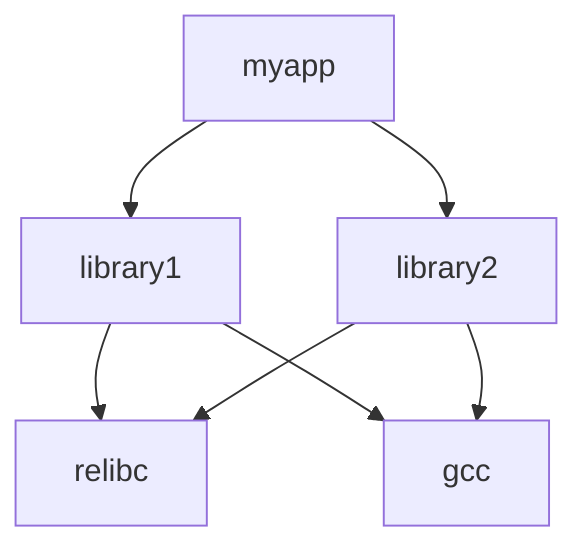

## Overview

The Redox OS recipe system, called **Cookbook**, is a package management and build system that handles compilation, installation, and dependency resolution for all userspace software. It's similar to ports systems on BSD or package build systems like Gentoo's Portage.

## What is a Recipe?

A recipe is a specification for building and installing a software package. Each recipe contains:

<CardGroup cols={2}>
  <Card title="Source" icon="code">
    Where to fetch the source code (Git, tarball, etc.)
  </Card>
  <Card title="Dependencies" icon="diagram-project">
    Build and runtime dependencies on other recipes
  </Card>
  <Card title="Build Instructions" icon="hammer">
    How to configure, compile, and install the software
  </Card>
  <Card title="Patches" icon="file-code">
    Modifications needed for Redox OS compatibility
  </Card>
</CardGroup>

## Recipe Location

Recipes are stored in the `recipes/` directory with this structure:

```
recipes/
├── core/              # Core system components
│   ├── kernel/       # Kernel recipe
│   ├── relibc/       # C library recipe
│   └── ...
├── drivers/          # Device drivers
├── gnu/              # GNU utilities
├── games/            # Games and entertainment
├── other/            # Third-party software
└── wip/              # Work in progress recipes
```

## Recipe Structure

Each recipe is a directory containing:

```
recipes/other/nano/
├── recipe.toml       # Recipe definition (required)
├── source/           # Downloaded source code
├── target/           # Build artifacts
│   └── $(TARGET)/
│       ├── build/    # Build directory
│       ├── stage/    # Installation staging
│       └── sysroot/  # Dependencies
└── *.patch           # Patch files (optional)
```

## Recipe Definition (recipe.toml)

The `recipe.toml` file defines how to build a package:

### Basic Recipe Example

```toml recipes/other/nano/recipe.toml
[source]
git = "https://git.savannah.gnu.org/git/nano.git"
rev = "v7.2"

[build]
template = "configure"
script = """
autoreconf -fi
./configure --host=${TARGET} --prefix=/usr
make -j${MAKE_JOBS}
"""

[build.dependencies]
ncurses = {}
```

### Recipe Sections

<Tabs>
  <Tab title="[source]">
    Defines where to get the source code:
    
    ```toml
    # Git repository
    [source]
    git = "https://github.com/redox-os/relibc.git"
    branch = "master"
    
    # Or specific revision
    [source]
    git = "https://github.com/user/project.git"
    rev = "abc123def456"
    
    # Tarball
    [source]
    tar = "https://example.com/package-1.2.3.tar.gz"
    blake3 = "sha256hash..."
    
    # Multiple Git sources
    [source]
    git = [
        { name = "main", url = "https://github.com/user/main.git", rev = "v1.0" },
        { name = "submodule", url = "https://github.com/user/sub.git", rev = "v0.5" }
    ]
    ```
  </Tab>
  
  <Tab title="[build]">
    Build instructions and template:
    
    ```toml
    [build]
    # Use a predefined build template
    template = "configure"  # or "cargo", "custom", "make", "cmake"
    
    # Custom build script
    script = """
    export CC=${TARGET}-gcc
    ./configure --host=${TARGET} --prefix=/usr
    make -j${MAKE_JOBS}
    make DESTDIR=${COOKBOOK_SYSROOT} install
    """
    
    # Build dependencies
    [build.dependencies]
    gcc = {}
    make = {}
    pkgconf = {}
    
    # Package runtime dependencies  
    [build.dependencies.runtime]
    relibc = {}
    ```
  </Tab>
  
  <Tab title="[package]">
    Package metadata:
    
    ```toml
    [package]
    name = "nano"
    version = "7.2"
    description = "Text editor"
    
    [package.dependencies]
    ncurses = {}
    relibc = {}
    ```
  </Tab>
</Tabs>

## Build Templates

Cookbook provides templates for common build systems:

### Configure Template

For autotools-based projects:

```toml
[build]
template = "configure"
script = """
autoreconf -fi
./configure \
    --host=${TARGET} \
    --prefix=/usr \
    --disable-shared \
    --enable-static
make -j${MAKE_JOBS}
make DESTDIR=${COOKBOOK_SYSROOT} install
"""
```

### Cargo Template

For Rust projects:

```toml
[build]
template = "cargo"

# Cookbook automatically runs:
# cargo build --release --target=${TARGET}
```

### CMake Template

For CMake-based projects:

```toml
[build]
template = "cmake"
script = """
mkdir build && cd build
cmake .. \
    -DCMAKE_TOOLCHAIN_FILE=${COOKBOOK_ROOT}/cmake/${TARGET}.cmake \
    -DCMAKE_INSTALL_PREFIX=/usr
make -j${MAKE_JOBS}
make DESTDIR=${COOKBOOK_SYSROOT} install
"""
```

### Custom Template

For unique build systems:

```toml
[build]
template = "custom"
script = """
# Your custom build commands
python3 setup.py build
python3 setup.py install --root=${COOKBOOK_SYSROOT} --prefix=/usr
"""
```

## Build Variables

These variables are available in build scripts:

<ParamField path="TARGET" type="string">
  Target triple (e.g., `x86_64-unknown-redox`)
</ParamField>

<ParamField path="COOKBOOK_ROOT" type="string">
  Root directory of the cookbook system
</ParamField>

<ParamField path="COOKBOOK_SYSROOT" type="string">
  Installation destination directory
</ParamField>

<ParamField path="COOKBOOK_RECIPE" type="string">
  Path to current recipe directory
</ParamField>

<ParamField path="COOKBOOK_SOURCE" type="string">
  Source code directory
</ParamField>

<ParamField path="COOKBOOK_BUILD" type="string">
  Build directory
</ParamField>

<ParamField path="COOKBOOK_STAGE" type="string">
  Staging directory for installation
</ParamField>

<ParamField path="MAKE_JOBS" type="integer">
  Number of parallel jobs for make
</ParamField>

<ParamField path="HOST" type="string">
  Host system triple
</ParamField>

## Recipe Commands

The build system provides shorthand commands for working with recipes:

### Basic Commands

<AccordionGroup>
  <Accordion title="r.PACKAGE - Build Recipe" icon="hammer">
    Build (cook) a recipe and its dependencies:
    
    ```bash
    make r.nano
    ```
    
    Build multiple recipes:
    ```bash
    make r.gcc,binutils,newlib
    ```
  </Accordion>
  
  <Accordion title="c.PACKAGE - Clean Recipe" icon="broom">
    Clean build artifacts:
    
    ```bash
    make c.kernel
    ```
    
    Clean specific recipe including sysroot:
    ```bash
    make c.relibc
    ```
  </Accordion>
  
  <Accordion title="f.PACKAGE - Fetch Source" icon="download">
    Download source code without building:
    
    ```bash
    make f.mesa
    ```
  </Accordion>
  
  <Accordion title="u.PACKAGE - Unfetch Source" icon="trash">
    Remove downloaded sources:
    
    ```bash
    make u.gcc
    ```
  </Accordion>
</AccordionGroup>

### Combined Commands

<CodeGroup>
```bash Clean and Rebuild
# Clean then build
make cr.relibc
```

```bash Unfetch, Clean, Rebuild
# Complete rebuild from fresh sources
make ucr.kernel
```

```bash Build and Push
# Build and install to disk image
make rp.nano
```

```bash Unfetch, Clean, Fetch
# Refresh sources without building
make ucf.gcc
```
</CodeGroup>

### Query Commands

```bash
# Find recipe location
make find.orbital

# Show build tree (dependencies)
make rt.mesa

# Show push tree (installation order)
make pt.desktop
```

## Working with Recipes

### Building a Single Package

<Steps>
  <Step title="Find the Recipe">
    ```bash
    make find.nano
    # Output: recipes/other/nano
    ```
  </Step>
  
  <Step title="Check Dependencies">
    ```bash
    make rt.nano
    # Shows dependency tree
    ```
  </Step>
  
  <Step title="Build the Recipe">
    ```bash
    make r.nano
    ```
  </Step>
  
  <Step title="Install to Image">
    ```bash
    make p.nano
    ```
  </Step>
</Steps>

### Modifying an Existing Recipe

<Steps>
  <Step title="Edit Recipe">
    Modify the recipe.toml file:
    ```bash
    nano recipes/other/nano/recipe.toml
    ```
  </Step>
  
  <Step title="Clean and Rebuild">
    ```bash
    make cr.nano
    ```
  </Step>
  
  <Step title="Test in Image">
    ```bash
    # Push to mounted image
    make mount
    make p.nano
    make unmount
    
    # Test in QEMU
    make qemu
    ```
  </Step>
</Steps>

### Creating a New Recipe

<Steps>
  <Step title="Create Recipe Directory">
    ```bash
    mkdir -p recipes/other/mypackage
    cd recipes/other/mypackage
    ```
  </Step>
  
  <Step title="Create recipe.toml">
    ```toml recipe.toml
    [source]
    git = "https://github.com/user/mypackage.git"
    branch = "main"
    
    [build]
    template = "configure"
    script = """
    ./configure --host=${TARGET} --prefix=/usr
    make -j${MAKE_JOBS}
    make DESTDIR=${COOKBOOK_SYSROOT} install
    """
    
    [build.dependencies]
    gcc = {}
    relibc = {}
    ```
  </Step>
  
  <Step title="Test Build">
    ```bash
    make r.mypackage
    ```
  </Step>
  
  <Step title="Add to Configuration">
    Add to your TOML config:
    ```toml config/mycustom.toml
    [packages]
    mypackage = {}
    ```
  </Step>
</Steps>

## Dependencies

### Build Dependencies

Required to build the package:

```toml
[build.dependencies]
gcc = {}
make = {}
pkgconf = {}
```

### Runtime Dependencies

Required to run the package:

```toml
[build.dependencies.runtime]
ncurses = {}
relibc = {}
```

### Dependency Chains

Cookbook automatically resolves dependency chains:



## Patches

Patches modify source code for Redox compatibility:

### Applying Patches

Place `.patch` files in the recipe directory:

```
recipes/other/nano/
├── recipe.toml
├── 01-fix-build.patch
└── 02-add-feature.patch
```

Cookbook automatically applies patches in alphabetical order.

### Creating Patches

```bash
cd recipes/other/nano/source

# Make your changes
vim src/nano.c

# Create patch
git diff > ../fix-issue.patch
```

### Patch Format

Use unified diff format:

```diff fix-issue.patch
--- a/src/nano.c
+++ b/src/nano.c
@@ -100,7 +100,7 @@
 int main(int argc, char **argv) {
-    // Old code
+    // New code
     return 0;
 }
```

## Repository Operations

### Building All Packages

```bash
# Build all packages in configuration
make repo

# Or implicitly through:
make all
```

### Cleaning Repository

```bash
# Clean all built packages
make repo_clean

# Clean and remove sources
make fetch_clean

# Complete clean
make distclean
```

### Offline Builds

Build without internet access:

```bash
# Fetch all sources first
make fetch

# Enable offline mode
echo 'REPO_OFFLINE=1' >> .config

# Build offline
make all
```

## Advanced Topics

### Binary Packages

Use pre-built packages:

```bash .config
REPO_BINARY=1
```

Cookbook will download pre-built packages from:
```
https://static.redox-os.org/pkg
```

### Debug Builds

Enable debug symbols:

```bash .config
REPO_DEBUG=1
```

This sets these environment variables:
```bash
COOKBOOK_NOSTRIP=true
COOKBOOK_DEBUG=true
```

### Continuing on Errors

Don't stop on recipe failures:

```bash .config
REPO_NONSTOP=1
```

Useful for CI or finding all broken recipes.

### AppStream Metadata

Generate application metadata:

```bash .config
REPO_APPSTREAM=1
```

### Cross-Compilation

Recipes support multiple architectures:

```bash
# Build for different architecture
make r.nano ARCH=aarch64

# Build tree shows arch-specific deps
make rt.nano ARCH=riscv64gc
```

## Recipe Best Practices

<AccordionGroup>
  <Accordion title="Use Templates" icon="stamp">
    Prefer built-in templates (`cargo`, `configure`, etc.) over custom scripts when possible.
  </Accordion>
  
  <Accordion title="Minimize Patches" icon="band-aid">
    Try to upstream changes rather than maintaining patches. Keep patches small and well-documented.
  </Accordion>
  
  <Accordion title="Specify Dependencies" icon="sitemap">
    Explicitly list all dependencies, including transitive ones that might be needed.
  </Accordion>
  
  <Accordion title="Test Incrementally" icon="flask">
    Test recipes in isolation before adding to system configuration.
  </Accordion>
  
  <Accordion title="Document Changes" icon="note-sticky">
    Add comments explaining non-obvious build steps or workarounds.
  </Accordion>
  
  <Accordion title="Version Pinning" icon="thumbtack">
    Use specific Git revisions or tags rather than branches for reproducibility.
  </Accordion>
</AccordionGroup>

## Troubleshooting Recipes

<AccordionGroup>
  <Accordion title="Build fails" icon="circle-xmark">
    **Check logs:**
    ```bash
    # Enable verbose output
    make r.package COOKBOOK_VERBOSE=1
    
    # Check build directory
    ls -la recipes/other/package/target/$(TARGET)/build/
    ```
  </Accordion>
  
  <Accordion title="Missing dependencies" icon="link-slash">
    **Verify dependency tree:**
    ```bash
    make rt.package
    
    # Check if dependencies are built
    make r.dependency
    ```
  </Accordion>
  
  <Accordion title="Patch fails to apply" icon="file-circle-xmark">
    **Check source version:**
    ```bash
    cd recipes/other/package/source
    git log --oneline
    
    # Regenerate patch
    git diff > ../new.patch
    ```
  </Accordion>
  
  <Accordion title="Cross-compilation errors" icon="arrows-left-right-to-line">
    **Check toolchain:**
    ```bash
    # Verify target is set
    echo $TARGET
    
    # Check compiler
    ${TARGET}-gcc --version
    
    # Rebuild toolchain
    make prefix
    ```
  </Accordion>
</AccordionGroup>

## Recipe Repository

Browse available recipes:

- **Core recipes:** `recipes/core/`
- **Drivers:** `recipes/drivers/`
- **GNU tools:** `recipes/gnu/`
- **Applications:** `recipes/other/`
- **Games:** `recipes/games/`

Online recipe browser: [recipes.redox-os.org](https://recipes.redox-os.org)

## Next Steps

<CardGroup cols={2}>
  <Card title="Configuration" icon="sliders" href="/build-system/configuration">
    Learn about configuration files
  </Card>
  <Card title="Build System Overview" icon="sitemap" href="/build-system/overview">
    Understand the complete build system
  </Card>
</CardGroup>
