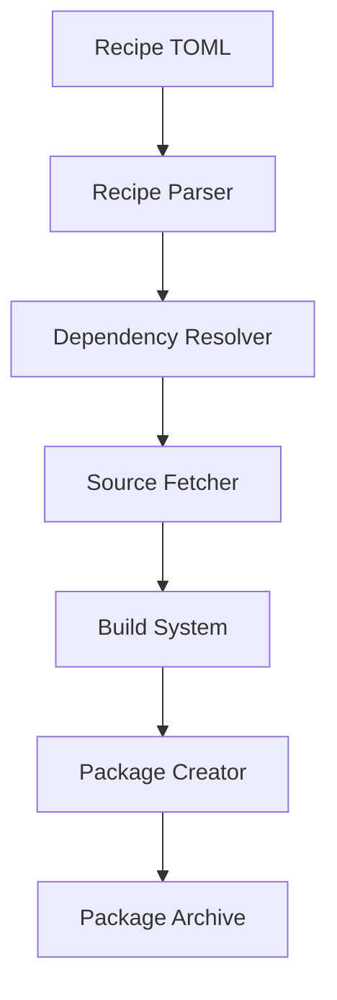

## Overview

The Cookbook is Redox OS's package build system, implemented in Rust. It manages downloading sources, building packages, handling dependencies, and creating package archives.

<Info>
The Cookbook is located in the main [redox repository](https://gitlab.redox-os.org/redox-os/redox) and is built as part of the bootstrap process.
</Info>

## Architecture

The Cookbook system consists of several key components:



### Core Modules

| Module | File | Purpose |
|--------|------|----------|
| Recipe | `src/recipe.rs` | Parse and validate recipe.toml files |
| Cook | `src/cook/` | Build orchestration and execution |
| Fetch | `src/cook/fetch.rs` | Download sources (git, tar, etc.) |
| Build | `src/cook/cook_build.rs` | Execute build templates |
| Package | `src/cook/package.rs` | Create .pkgar archives |

## Recipe Data Structures

The recipe system is built around strongly-typed Rust structures defined in `src/recipe.rs`.

### Recipe Structure

```rust
pub struct Recipe {
    pub source: Option<SourceRecipe>,
    pub build: BuildRecipe,
    pub package: PackageRecipe,
    pub optional_packages: Vec<OptionalPackageRecipe>,
}
```

### Source Types

```rust
pub enum SourceRecipe {
    Git {
        git: String,
        upstream: Option<String>,
        branch: Option<String>,
        rev: Option<String>,
        shallow_clone: Option<bool>,
        patches: Vec<String>,
        script: Option<String>,
    },
    Tar {
        tar: String,
        blake3: Option<String>,
        patches: Vec<String>,
        script: Option<String>,
    },
    Path {
        path: String,
    },
    SameAs {
        same_as: String,
    },
}
```

### Build Templates

```rust
pub enum BuildKind {
    None,
    Remote,
    Cargo {
        cargopath: Option<String>,
        cargoflags: Vec<String>,
        cargopackages: Vec<String>,
        cargoexamples: Vec<String>,
    },
    Configure {
        configureflags: Vec<String>,
    },
    Cmake {
        cmakeflags: Vec<String>,
    },
    Meson {
        mesonflags: Vec<String>,
    },
    Custom {
        script: String,
    },
}
```

## Build Process

The Cookbook follows a multi-stage build process:

### 1. Recipe Discovery

```bash
make r.package-name
```

The build system:
1. Locates `recipes/category/package-name/recipe.toml`
2. Parses the TOML into a `Recipe` struct
3. Validates all required fields

### 2. Dependency Resolution

The Cookbook recursively resolves dependencies:

```rust
pub fn get_build_deps_recursive(
    names: &[PackageName],
    include_dev: bool,
) -> Result<Vec<Self>, PackageError>
```

**Algorithm:**
1. Parse recipe for target package
2. Collect `build.dependencies`
3. Recursively resolve dependencies of dependencies
4. De-duplicate and topologically sort
5. Return ordered list of packages to build

<Warning>
The Cookbook enforces a maximum recursion depth (defined by `WALK_DEPTH`) to prevent infinite dependency loops.
</Warning>

### 3. Source Fetching

Implemented in `src/cook/fetch.rs` and `src/cook/fetch_repo.rs`.

#### Git Repositories

```rust
// Clone repository
git clone ${GIT_URL} ${SOURCE_DIR}

// Checkout specific revision if specified
if let Some(rev) = recipe.source.rev {
    git checkout ${rev}
}

// Apply patches
for patch in patches {
    patch -p1 < ${patch}
}
```

#### Tar Archives

```rust
// Download tarball
let bytes = download(tar_url)?;

// Verify BLAKE3 checksum
if let Some(expected_hash) = blake3 {
    let actual_hash = blake3::hash(&bytes);
    assert_eq!(expected_hash, actual_hash);
}

// Extract archive
extract_tar(bytes, source_dir)?;

// Apply patches
apply_patches(patches)?;
```

### 4. Build Execution

Implemented in `src/cook/cook_build.rs`.

#### Template Execution

Each template has a corresponding build function:

```rust
match recipe.build.kind {
    BuildKind::Cargo { .. } => build_cargo(recipe)?,
    BuildKind::Configure { .. } => build_configure(recipe)?,
    BuildKind::Cmake { .. } => build_cmake(recipe)?,
    BuildKind::Meson { .. } => build_meson(recipe)?,
    BuildKind::Custom { script } => build_custom(recipe, script)?,
    BuildKind::None => {},
    BuildKind::Remote => download_remote(recipe)?,
}
```

#### Build Environment

The Cookbook sets up a complete build environment:

```bash
# Target configuration
export TARGET=x86_64-unknown-redox
export GNU_TARGET=x86_64-redox
export ARCH=x86_64

# Directories
export COOKBOOK_SOURCE=/path/to/source
export COOKBOOK_STAGE=/path/to/staging
export COOKBOOK_SYSROOT=/path/to/sysroot

# Tools
export CC=${TARGET}-gcc
export CXX=${TARGET}-g++
export AR=${TARGET}-ar
export RANLIB=${TARGET}-ranlib

# Flags
export CFLAGS="-I${COOKBOOK_SYSROOT}/usr/include"
export LDFLAGS="-L${COOKBOOK_SYSROOT}/usr/lib"
export PKG_CONFIG_PATH="${COOKBOOK_SYSROOT}/usr/lib/pkgconfig"
```

### 5. Package Creation

Implemented in `src/cook/package.rs`.

#### Staging Directory

All installed files go to a staging directory:

```text
target/${TARGET}/${PACKAGE}/stage/
├── usr/
│   ├── bin/
│   │   └── program
│   ├── lib/
│   │   └── libfoo.so
│   └── share/
│       └── doc/
```

#### Package Archive Format

The Cookbook creates `.tar.gz` and `.pkgar` archives:

```rust
// Create pkgar archive
let archive_path = format!("target/{}/{}.tar.gz", target, package_name);
let pkgar_path = format!("target/{}/{}.pkgar", target, package_name);

// Package contains:
// - All files from staging directory
// - Metadata (dependencies, version, etc.)
```

## Dependency Management

### Dependency Types

The Cookbook distinguishes between three types of dependencies:

1. **Build Dependencies** - Required to compile
2. **Dev Dependencies** - Additional build tools
3. **Package Dependencies** - Required at runtime

```toml
[build]
dependencies = ["zlib"]        # Build deps
dev-dependencies = ["cmake"]   # Dev deps

[package]
dependencies = ["ca-certificates"]  # Runtime deps
```

### Auto-Detection

The Cookbook can automatically detect runtime dependencies through dynamic linking analysis:

```rust
fn auto_deps_from_dynamic_linking(
    stage_dirs: &[PathBuf],
    target_dir: &Path,
    dep_pkgars: &BTreeSet<(PackageName, PathBuf)>,
) -> BTreeSet<PackageName>
```

**Process:**
1. Scan all ELF binaries in staging directory
2. Extract `DT_NEEDED` entries from dynamic section
3. Match libraries to packages
4. Return set of required packages

<Info>
Auto-detected dependencies are written to `target/${TARGET}/${PACKAGE}/auto_deps.toml`.
</Info>

## Configuration System

Recipes can be configured per-target in `.config/${TARGET}/repo.toml`:

```toml
[packages]
# Build from source (default)
package1 = "source"

# Keep local changes, don't update
package2 = "local"

# Download pre-built binary
package3 = "binary"

# Don't build at all
package4 = "ignore"
```

### Configuration Application

```rust
impl CookRecipe {
    pub fn apply_filesystem_config(&mut self, rule: &str) -> Result<()> {
        match rule {
            "source" => {},  // Build normally
            "local" => self.recipe.source = None,  // Skip fetch
            "binary" => self.recipe.build.set_as_remote(),  // Download
            "ignore" => self.recipe.build.set_as_none(),  // Skip
            _ => bail!("Invalid config rule"),
        }
    }
}
```

## Parallel Builds

The Cookbook supports parallel compilation:

```bash
# Build with 8 parallel jobs
make -j8 all

# Set COOKBOOK_MAKE_JOBS for individual recipes
export COOKBOOK_MAKE_JOBS=8
```

Within recipes:

```bash
make -j"${COOKBOOK_MAKE_JOBS}"
```

## Build Targets

The Makefile provides numerous targets:

### Recipe Targets

```bash
make r.RECIPE           # Build recipe
make f.RECIPE           # Fetch recipe source
make u.RECIPE           # Update recipe source
make c.RECIPE           # Clean recipe build
make cr.RECIPE          # Clean and rebuild
make r.RECIPE.tar       # Build recipe and dependencies
```

### Package Operations

```bash
make pkg.RECIPE         # Create package archive
make publish.RECIPE     # Publish to repository
make unpublish.RECIPE   # Remove from repository
```

### Batch Operations

```bash
make fetch              # Fetch all recipe sources
make unfetch            # Remove all sources
make clean              # Clean all builds
make rebuild            # Clean and rebuild all
```

## Source Structure

The Cookbook source code organization:

```text
src/
├── lib.rs              # Library root
├── main.rs             # CLI entry point
├── config.rs           # Configuration parsing
├── recipe.rs           # Recipe data structures
└── cook/
    ├── mod.rs          # Cook module root
    ├── cook_build.rs   # Build execution
    ├── fetch.rs        # Source fetching
    ├── fetch_repo.rs   # Git repository handling
    ├── fs.rs           # Filesystem operations
    ├── ident.rs        # Package identification
    ├── package.rs      # Package creation
    ├── pty.rs          # Terminal output
    ├── script.rs       # Build script execution
    └── tree.rs         # Dependency tree
```

## Recipe Lookup

Recipes are discovered through the `pkg` crate:

```rust
use pkg::recipes;

// Find recipe directory by package name
let dir = recipes::find("package-name")
    .ok_or(PackageError::PackageNotFound)?;

// Load recipe.toml
let recipe_path = dir.join("recipe.toml");
let recipe = Recipe::new(&recipe_path)?;
```

## Error Handling

The Cookbook uses structured error types:

```rust
pub enum PackageError {
    FileMissing(PathBuf),
    Parse(serde::de::Error, Option<PathBuf>),
    PackageNotFound(PackageName),
    Recursion(PackageName),
    BuildFailed(String),
}
```

Errors include context about:
- Which recipe failed
- Dependency chain leading to failure
- Specific build errors

## Caching

The Cookbook caches multiple stages:

### Source Cache

```text
source/
└── package-name/
    └── source files...
```

<Info>
Sources are cached across builds. Use `make u.RECIPE` to update.
</Info>

### Build Cache

```text
target/${TARGET}/
├── package-name/
│   ├── build/          # Build directory
│   ├── stage/          # Staged files
│   ├── package.tar.gz  # Package archive
│   └── package.pkgar   # pkgar format
```

### Sysroot Cache

Dependencies are extracted to a shared sysroot:

```text
target/${TARGET}/sysroot/
├── usr/
│   ├── include/    # Headers from all deps
│   └── lib/        # Libraries from all deps
```

## Advanced Features

### Host vs Target Packages

The Cookbook can build packages for both host and target:

```rust
pub fn package_target(name: &PackageName) -> &'static str {
    if name.is_host() {
        "host"
    } else {
        env!("TARGET")
    }
}
```

**Host packages** run on the build machine (e.g., build tools).
**Target packages** run on Redox (e.g., user applications).

### Optional Package Splitting

A single recipe can produce multiple packages:

```rust
pub struct OptionalPackageRecipe {
    pub name: String,              // Package suffix
    pub dependencies: Vec<PackageName>,
    pub files: Vec<String>,        // File patterns
}
```

Example: `openssl` produces:
- `openssl` (runtime libraries)
- `openssl-dev` (headers and static libraries)

### Version Detection

The Cookbook can auto-detect versions from sources:

```rust
impl SourceRecipe {
    pub fn guess_version(&self) -> Option<String> {
        match self {
            SourceRecipe::Tar { tar, .. } => {
                // Extract version from URL
                let re = Regex::new(r"\d+\.\d+\.\d+").unwrap();
                re.find(tar).map(|m| m.as_str().to_string())
            }
            _ => None,
        }
    }
}
```

## Debugging

### Verbose Mode

```bash
make VERBOSE=1 r.package-name
```

Enables:
- Full command output
- Dependency resolution details
- Build environment variables

### Build Logs

Logs are written to:

```text
build/${TARGET}/${PACKAGE}/
├── fetch.log      # Source download log
├── build.log      # Compilation output
└── package.log    # Packaging log
```

### Interactive Debugging

Enter the build environment:

```bash
# Start interactive shell in build directory
make shell.package-name
```

## Performance Optimization

### Parallel Fetching

The Cookbook can fetch multiple sources in parallel:

```bash
make -j8 fetch
```

### Incremental Builds

Only rebuild when necessary:
- Source changes detected via checksums
- Dependency updates trigger rebuilds
- Build artifacts cached

### Binary Downloads

For faster builds, use pre-built binaries:

```toml
[build]
template = "remote"
```

Or configure in `repo.toml`:

```toml
[packages]
llvm = "binary"  # Download instead of building
```

## Integration Points

### Package Manager

The Cookbook produces packages consumed by `pkg` (Redox's package manager):

```bash
pkg install package-name
```

### Installer

The system installer uses Cookbook packages:

```bash
installer install package-name
```

### Build System

The main build system orchestrates Cookbook:

```makefile
$(BUILD)/$(TARGET)/%.tag:
	$(COOKBOOK) recipe $*
```

## Testing Recipes

### Unit Tests

Recipe parsing has unit tests:

```rust
#[test]
fn git_cargo_recipe() {
    let recipe: Recipe = toml::from_str(r#"
        [source]
        git = "https://gitlab.redox-os.org/redox-os/acid.git"
        
        [build]
        template = "cargo"
    "#).unwrap();
    
    assert_eq!(recipe.build.kind, BuildKind::Cargo { .. });
}
```

### Integration Tests

Test recipes in QEMU:

```bash
make qemu
# Inside Redox:
pkg install test-package
test-package --verify
```

## Best Practices

<CardGroup cols={2}>
  <Card title="Cache Friendly" icon="database">
    Structure recipes to maximize cache reuse across builds.
  </Card>
  
  <Card title="Dependency Minimal" icon="diagram-project">
    Only declare dependencies actually used - extras slow builds.
  </Card>
  
  <Card title="Reproducible" icon="repeat">
    Pin versions, use checksums, specify revisions for reproducible builds.
  </Card>
  
  <Card title="Error Handling" icon="triangle-exclamation">
    Provide clear error messages in custom build scripts.
  </Card>
</CardGroup>

## See Also

- [Recipe Format Reference](/reference/recipe-format) - Complete recipe TOML specification
- [Application Porting Guide](/reference/porting-applications) - How to port software
- [Build System Reference](https://doc.redox-os.org/book/build-system-reference.html) - Full build system documentation
- [Cookbook Repository](https://gitlab.redox-os.org/redox-os/redox) - Source code
